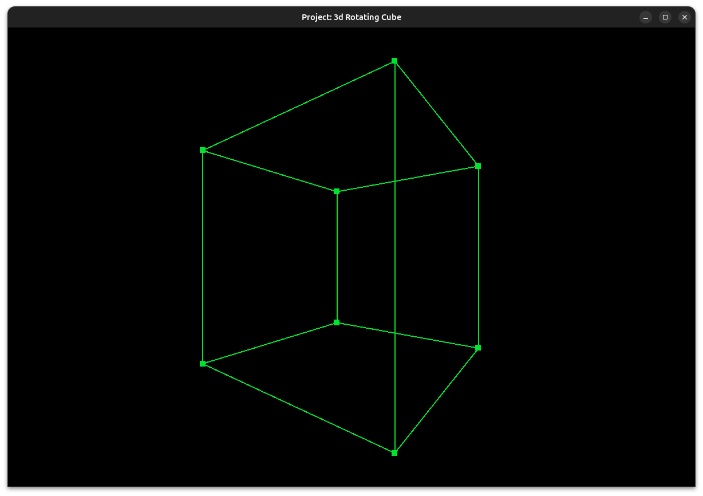

# Weak Perspective Projection



## Project Overview

This project implements **weak perspective projection**, a computer graphics technique used for 3D to 2D transformation. It leverages the raylib graphics library to visualize and demonstrate weak perspective projection concepts.

## What is Weak Perspective Projection?

Weak perspective projection is a simplified 3D-to-2D transformation technique that:

- Assumes all objects are at approximately the same distance from the camera
- Uses a **uniform scaling factor** for the entire scene (unlike full perspective projection which scales per-point)
- Provides computational efficiency while maintaining reasonable visual accuracy
- Is commonly used in robotics, medical imaging, and certain graphics applications

## Project Structure

```
weak-perspective-projection/
├── include/               # Project header files
│   ├── raylib.h
│   ├── raymath.h
│   └── rlgl.h
├── lib/                   # Compiled libraries
├── bin/                   # Compiled executables
├── src/                   # Project source code
│   └── main.cpp           # Main application entry point
├── media/                 # Project relevant media
├── Makefile               # Build configuration
├── README.md              # This file
└── LICENSE                # Project license
```

## Dependencies

### raylib 5.5.0+

This project depends on **[raylib](https://www.raylib.com/)** - a simple and easy-to-use graphics library.

## Building the Project

### Prerequisites

- C/C++ compiler (GCC, Clang, MSVC)
- Make utility
- raylib library compiled or available

### Build Instructions

#### Using Make (Recommended)

```bash
make
```

#### Manual Compilation

```bash
# Compile raylib (if not already built)
cd raylib/src
make PLATFORM=PLATFORM_DESKTOP

# Compile the project
cd weak-perspective-projection/
g++ src/main.cpp -o bin/main.out -std=c++17 -isystem include/ -Llib -lraylib -lGL -lm -lpthread -ldl -lrt -lX11 -Wall -Wextra -Wpedantic -Wshadow -Wconversion -Wsign-conversion -O0 -g
```

### Running the Application

```bash
./bin/main
```

## License

This project is licensed under the same terms as raylib.

### raylib License

raylib is licensed under an unmodified **zlib/libpng license** - an OSI-certified, BSD-like license that allows static linking with closed source software.

**License File:** raylib/LICENSE
